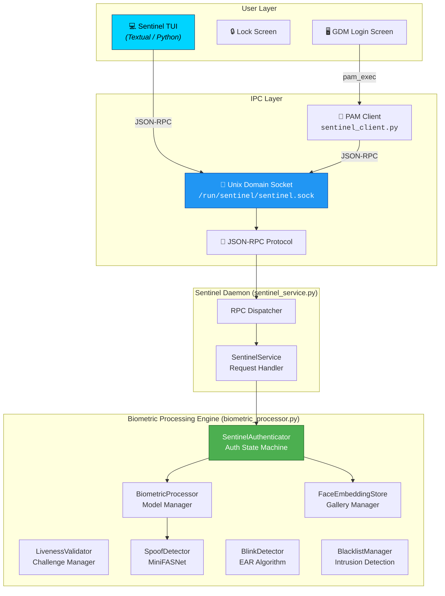

# 🛡️ Project Sentinel: Advanced Biometric Authentication for Linux

<div align="center">

**A secure, daemon-based face recognition system designed to bring "Windows Hello"-like biometric unlock to Linux desktops.**

Built for **Fedora / Wayland** | Powered by **ONNX Runtime** & **MediaPipe** | Privacy-First — **100% Local Processing**

</div>

---

> [!WARNING]
> **🚧 Work In Progress — GTK App Under Active Development 🚧**
>
> The **Vala/GTK4 desktop application** (enrollment & settings UI) is currently **under active development**. I am learning **Vala** to build a native, high-performance GNOME application for this project. The core biometric engine and daemon are fully functional, but the GTK app's installation and integration are still being worked on.
>
> **If you have experience with Vala, GTK4, or Meson and would like to help build the app, your contributions would be incredibly valuable!** Feel free to open an issue or submit a pull request.

---

> [!NOTE]
> **🚧 TUI Client Work in Progress 🚧**
>
> Project Sentinel now includes a highly responsive, standalone **Terminal User Interface (TUI)** built with Python and Textual to control the background biometric daemon. You can enroll faces, manage settings, view live HD camera previews, and monitor intrusion logs directly from your terminal!

---

## 📖 Table of Contents

- [Overview](#-overview)
- [Key Features](#-key-features)
- [System Architecture](#%EF%B8%8F-system-architecture)
- [How It Works](#-how-it-works)
- [Installation & Setup](#%EF%B8%8F-installation--setup)
- [Using the Sentinel TUI](#-using-the-sentinel-tui)
- [Face Enrollment](#-face-enrollment)
- [Configuration](#-configuration)
- [Project Structure](#-project-structure)
- [Contributing](#-contributing)

---

## 🌟 Overview

**Project Sentinel** is a comprehensive biometric authentication system for Linux. It acts as a persistent background daemon that keeps AI models warm in memory, enabling near-instant face recognition (**<100ms** response time) for GDM login and lock screen unlock.

Unlike cloud-based solutions, **all processing happens entirely on your machine**. Your face embeddings, intrusion logs, and camera data never leave your device.

---

## 🚀 Key Features

| Feature | Description |
|---|---|
| ⚡ **Instant Unlock** | Daemon architecture keeps models loaded in memory for <100ms response time |
| 🔐 **Multi-Tier Security** | Golden / Standard / 2FA confidence zones with escalating access control |
| 👁️ **Liveness Detection** | Anti-spoofing using MiniFASNet ONNX models to prevent photo/video attacks |
| 🎯 **Interactive Challenges** | Random head-turn challenges + mandatory blink test for robust liveness verification |
| 🧠 **Adaptive Embeddings** | System learns your face over time (lighting, glasses, aging) via a FIFO adaptive gallery |
| 🚨 **Intrusion Detection (IDS)** | Detects and logs unrecognized faces with screenshots; blacklists repeat offenders |
| 📊 **Audit Logging** | Detailed daily log files with 30-day FIFO retention |
| 🔧 **PAM Integration** | Native `pam_exec` integration with GDM for seamless login/unlock |
| 🖥️ **Kalman Tracking** | Target locking with Kalman filter for stable face tracking across frames |
| 💻 **Textual TUI Client** | Beautiful dashboard for hardware mapping and real-time live testing |

### Multi-Tier Confidence System

The system uses cosine distance between face embeddings to determine access:

| Zone | Distance Threshold | Action |
|---|---|---|
| 🥇 **Golden** | ≤ 0.25 | Instant access + adaptive learning |
| ✅ **Standard** | ≤ 0.42 | Standard access granted |
| ⚠️ **Two-Factor** | ≤ 0.50 | Requires liveness check + PIN/password |
| ❌ **Failure** | > 0.50 | Access denied, intrusion logged |

---

## 🏗️ System Architecture

The system follows a **client-daemon** architecture with three core layers:



---

## 🧪 How It Works

### 1. Face Detection — YuNet
The system uses **OpenCV's DNN-based YuNet** model to detect faces in real time. It returns bounding boxes and confidence scores.

### 2. Anti-Spoofing — MiniFASNet
Before recognition attempts, every detected face is run through the **MiniFASNet** anti-spoofing model to classify whether the face is a live person or a printed photo / screen replay.

### 3. Face Recognition — SFace
Faces that pass the spoof check are fed into **SFace** to generate a **128-dimensional embedding vector**. This embedding is compared against the enrolled gallery using **cosine distance**.

### 4. Liveness Verification — MediaPipe
For low-confidence checks, **MediaPipe** maps 468 facial anchor points to perform Blink Detection via the **Eye Aspect Ratio (EAR)** algorithm.

---

## 🛠️ Installation & Setup

A single script handles everything: system dependencies, AI model downloads, Python environments, the systemd service, and permissions.

### Prerequisites

- **OS:** Fedora 40+ (Recommended) — designed for Wayland/GNOME
- **Hardware:** Supported V4L2 Webcam
- **Python:** 3.10+ (Python 3.14 fully supported)

### Install

```bash
# 1. Clone the repository
git clone https://github.com/MSpider3/Project-Sentinel.git
cd Project-Sentinel

# 2. Run the Setup Wizard (must be root — handles everything)
chmod +x setup.sh
sudo ./setup.sh

# 3. Re-login (so your user gets the 'video' group for camera access)
```

That's it. The daemon starts automatically and runs on every boot via systemd.

### Update / Reinstall

Re-run the same script. It is fully idempotent — re-running applies updates without losing your enrolled faces or config:

```bash
sudo ./setup.sh
```

### Developer Quick-Deploy

When iterating on `core/` files without a full reinstall, use `make deploy` instead:

```bash
make deploy        # Copies core/*.py + sentinel_tui/ to live system, restarts daemon
```

---

## 💻 Using the Sentinel TUI

The Sentinel Control Interface communicates with the root-locked daemon over a Unix socket using JSON-RPC.

```bash
# Launch the TUI (installed globally by setup.sh)
sentinel

# Or use make from the project directory
make run
```

### TUI Features
- **Dashboard**: Track daemon uptime, configuration versions, active cameras, and model states. Live log streaming with color-coded levels and component filtering.
- **Authentication**: Test face recognition and liveness challenges in real time — with a **live OpenCV camera preview** that pops up automatically.
- **Enrollment**: Register new faces via a guided 5-pose wizard — with a **live OpenCV camera preview** showing your face position and detection status.
- **Device Manager**: Enumerate V4L2 cameras, view capabilities, and hot-swap the active `/dev/video*` device.
- **Settings**: Pull and hot-reload all daemon thresholds with field-level validation.

---

## 👤 Face Enrollment

Enrolling a new biometric gallery uses the Textual TUI wizard.

1. Launch the TUI using `make run`.
2. Tap the `[5] Enroll Face` action from the left-side navigation rail.
3. Enter your short **Username**. 
4. Click **Start Camera**.
5. The `sentinel-backend.service` will begin processing frames and evaluating them through the engine. The TUI will stream live warnings like `"Face too small"` or `"Multiple faces detected"`.
6. Look in the requested directions (Center, Left, Right, Up, Down) to capture a rich 3D vector.

### Real-Time Pipeline Testing
Want to test exactly what the PAM module will see when you try to unlock your laptop?
Open the **Authentication Test** screen in the TUI, select your namespace, and hit `Start`. You will see the physical Cosine Distance numbers mapping live!

---

## ⚙️ Configuration

All settings are externalized via `config.ini` in the project root. While you *can* edit this manually, pulling up the **TUI Settings Editor** is heavily recommended, as it will automatically validate thresholds like integers out-of-bounds.

**Examples of what you can control:**
- `fps = 15`: Drops webcam frame evaluations down to save serious laptop battery.
- `two_factor_threshold = 0.50`: How strict the algorithm is before requesting a password alongside face unlock.
- `spoof_threshold = 0.92`: How aggressively MiniFASNet blocks picture attacks.

---

## 📂 Project Structure

```
├── core/
│   ├── sentinel_service.py        # 🔧 JSON-RPC Daemon Server
│   ├── biometric_processor.py     # 🧠 Core engine
│   ├── sentinel_logger.py         # 📝 Structured Log Exporter
│   └── sentinel_client.py         # 🔑 PAM connector 
├── sentinel-tui/                  # 💻 TUI (Textual) Python interface
│   ├── app.py                     # Entry layout
│   ├── screens/                   # Subsystems (enrollment, settings, diagnostic)
│   ├── scripts/                   # OpenCV Sub-process detached viewer
│   └── services/                  # JSON-RPC integration layer
├── config.ini                     # ⚙️ Universal configuration bounds
├── setup.sh                       # 📦 System dependency wizard
├── Makefile                       # 📋 TUI automation
├── pyproject.toml                 # uv manifest
└── models/                        # 🤖 ONNX Models (YuNet, SFace, MiniFASNet)
```

---

## 🤝 Contributing

We are focusing primarily on optimizing the Python Biometric Engine speeds and expanding the TUI integration patterns.

- Submit a Pull Request targeting `/sentinel-tui/` if you add any cool Textual Dashboard widgets.
- File issues if SELinux blocks your V4L2 `/dev/video*` mappings.

### Other Contribution Areas
- **Testing** on different Linux distributions
- **IR camera** support and testing
- **Performance** optimizations for the biometric engine
- **Documentation** improvements
- **RPM packaging** and Flatpak support

### How to Contribute

1. Fork the repository
2. Create a feature branch (`git checkout -b feature/amazing-feature`)
3. Commit your changes (`git commit -m 'Add amazing feature'`)
4. Push to the branch (`git push origin feature/amazing-feature`)
5. Open a Pull Request

---

## 📜 License

MIT License — see [LICENSE](LICENSE) for details.

---

<div align="center">

**Project Sentinel** — Bringing biometric authentication to the Linux desktop. 🐧

*Made with ❤️ for the open-source community.*

</div>
